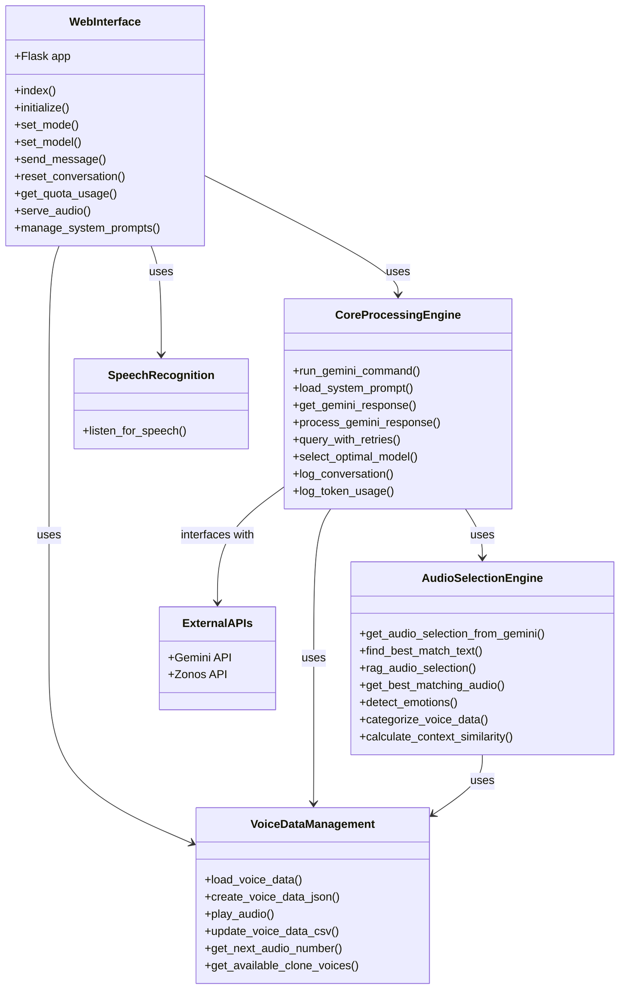
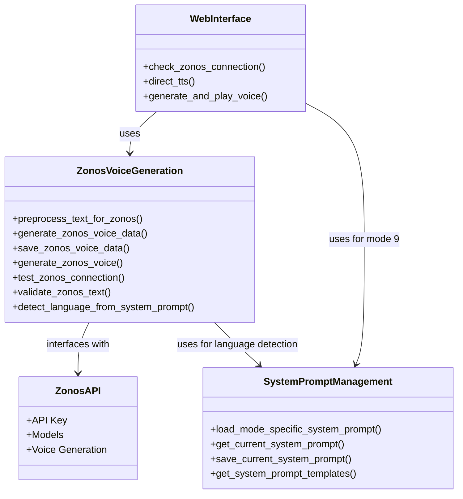
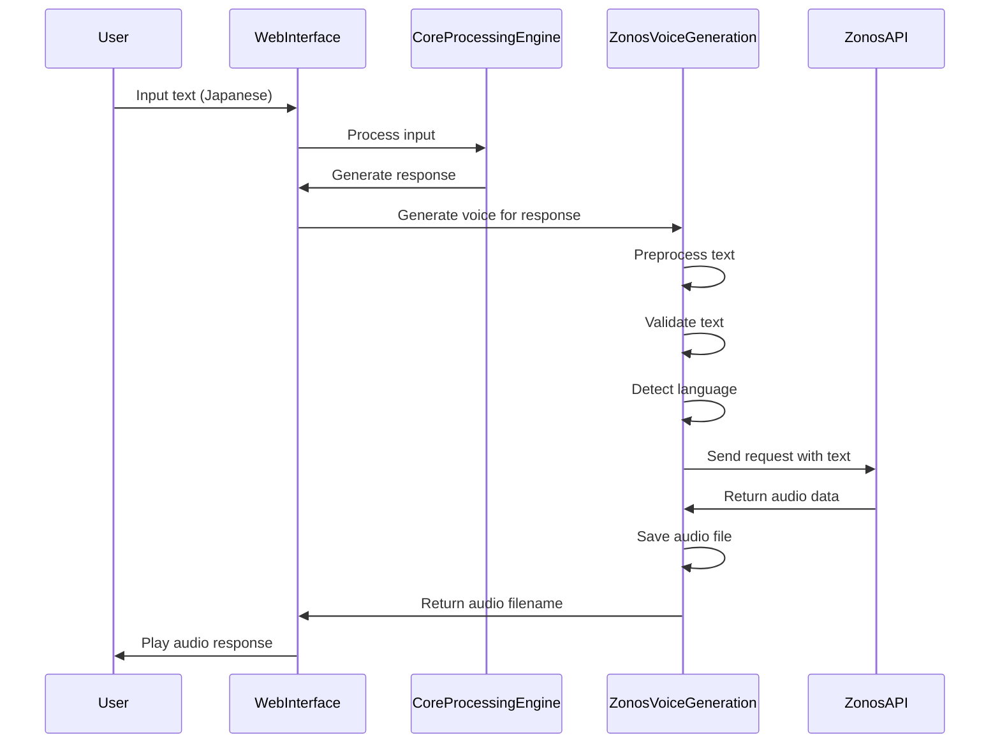

# VBeing_Research System Architecture Class Diagram

## Overview

This document provides class diagrams for the VBeing_Research system architecture. Since the system is primarily implemented using a functional programming approach rather than a class-based structure, these diagrams represent the components and their relationships rather than traditional class hierarchies.

## System Components Diagram

## Zonos Integration for Japanese Mode

## Data Flow for Zonos Voice Generation

## Component Relationships

The system uses a functional programming approach with these key relationships:

1. **Web Interface** (`web_interface.py`)
   - Imports and uses functions from the Core Processing Engine
   - Handles HTTP routes and user interactions
   - Manages mode selection, including Zonos mode (Mode 9)

2. **Core Processing Engine** (`play_voice_with_gemini.py`)
   - Contains the main logic for processing user inputs
   - Interfaces with external APIs (Gemini and Zonos)
   - Manages audio selection and generation

3. **Zonos Integration**
   - Functions in both files work together to:
     - Check connection status
     - Preprocess and validate text
     - Generate voice using the Zonos API
     - Save and serve audio files

4. **System Prompt Management**
   - Handles loading and saving system prompts
   - Uses mode-specific templates, including the Japanese Zonos template