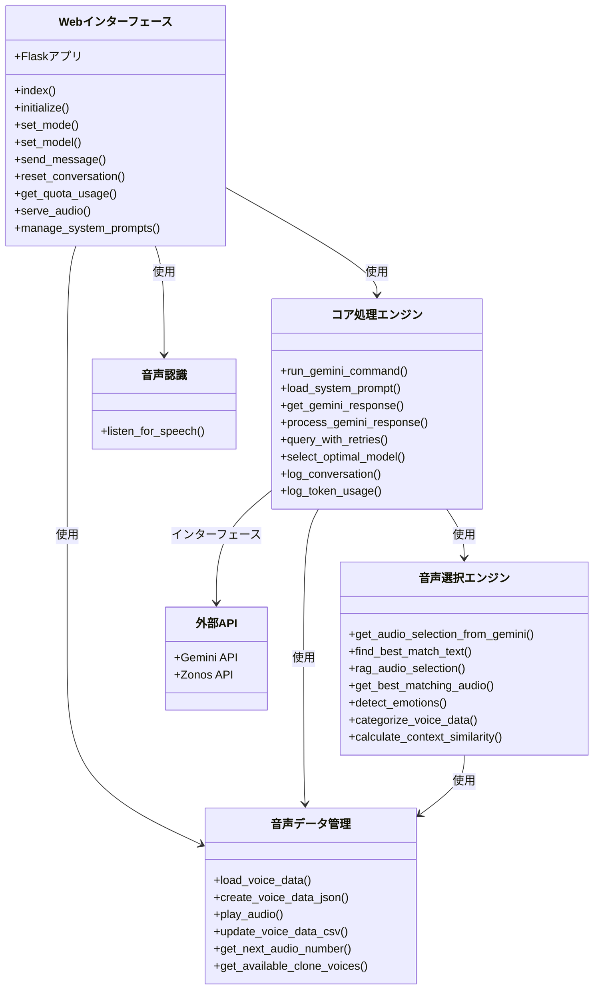
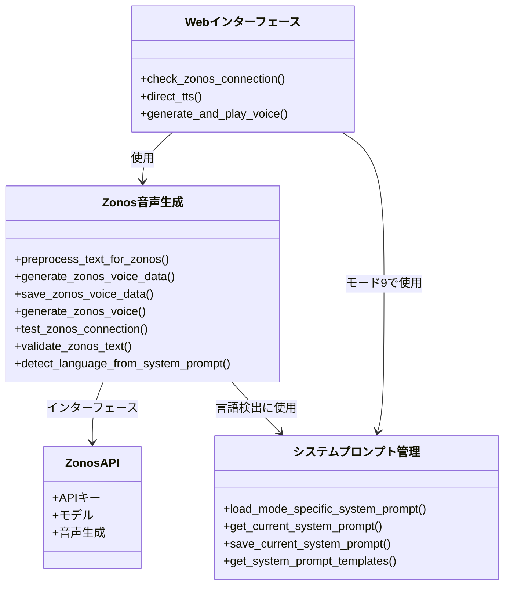
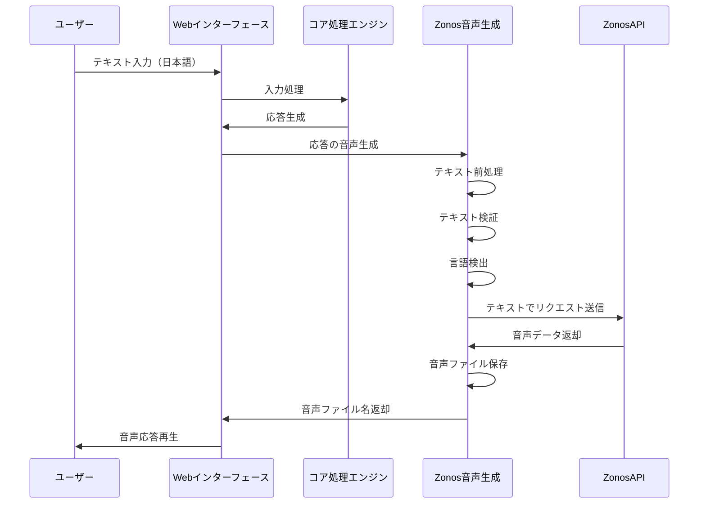

# VBeing_Research システムアーキテクチャ クラス図

## 概要

このドキュメントはVBeing_Researchシステムアーキテクチャのクラス図を提供します。システムは主に関数型プログラミングアプローチを使用して実装されており、クラスベースの構造ではないため、これらの図は従来のクラス階層ではなく、コンポーネントとその関係を表しています。

## システムコンポーネント図

## 日本語モードでのZonos統合

## Zonos音声生成のデータフロー

## コンポーネント関係

システムは関数型プログラミングアプローチを使用し、以下の主要な関係があります：

1. **Webインターフェース** (`web_interface.py`)
   - コア処理エンジンから関数をインポートして使用
   - HTTPルートとユーザー対話を処理
   - Zonosモード（モード9）を含むモード選択を管理

2. **コア処理エンジン** (`play_voice_with_gemini.py`)
   - ユーザー入力を処理するメインロジックを含む
   - 外部API（GeminiとZonos）とのインターフェース
   - 音声選択と生成を管理

3. **Zonos統合**
   - 両方のファイルの関数が連携して以下を実行：
     - 接続状態の確認
     - テキストの前処理と検証
     - Zonos APIを使用した音声生成
     - 音声ファイルの保存と提供

4. **システムプロンプト管理**
   - システムプロンプトの読み込みと保存を処理
   - 日本語Zonosテンプレートを含むモード固有のテンプレートを使用